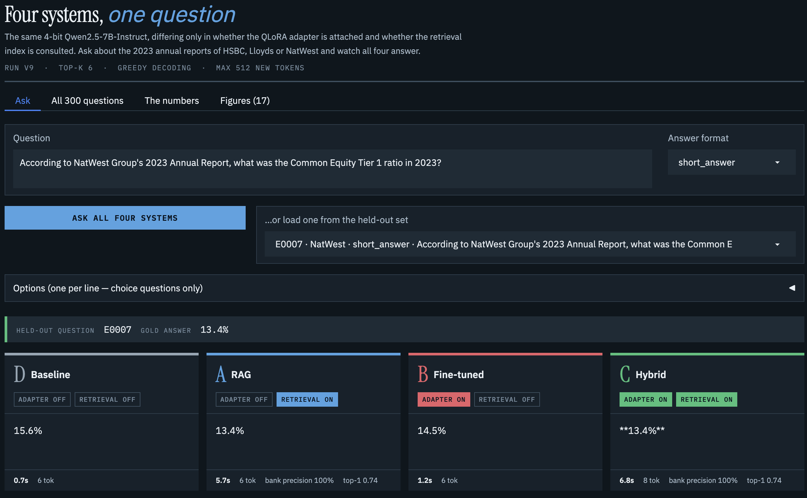

# Fine-Tuning vs RAG vs Hybrid

**A Comparative Framework for Domain-Specific LLM Adaptation in Financial Services**

MSc Artificial Intelligence dissertation, Manchester Metropolitan University (unit 6G7V0007).
Ihsan Abourshaid · supervised by Prof. Keeley Crockett · September 2026.

This repository holds the code, frozen data assets and complete run artefacts behind the
dissertation. Every number reported in the write-up can be traced to a named file here.

---

## What the study does

Four systems share one base model (Qwen2.5-7B-Instruct, 4-bit NF4), one prompt template, one
greedy decoding configuration and one held-out 300-question evaluation set, so adaptation
strategy is the only independent variable:

| Condition | System | Weights | Retrieval | Objective accuracy |
|---|---|---|---|---|
| D | Baseline | base, unmodified | none | 22.1% |
| A | RAG | base, unmodified | top-6 | 64.2% |
| B | Fine-tuned | base + QLoRA adapter | none | 27.5% |
| C | Hybrid | base + QLoRA adapter | top-6 | 66.3% |

The hybrid's 2.1-point lead over RAG is **not** statistically significant (exact McNemar
p = 0.42), and the hybrid abstains on 0 of 30 unanswerable questions where RAG abstains on 23
(Fisher p = 1.7 × 10⁻¹⁰). The dissertation therefore recommends RAG alone. The contribution is
the evaluation framework, not the financial result.

## Layout

```
dissertation_full_pipeline_v9_1.ipynb   the pipeline: data prep, training, inference, scoring, figures
demo_four_systems.ipynb                 Gradio demo serving the frozen v9.1 artefacts side by side
docs/                                   screenshot of the demo interface
comparison_300_four_conditions.csv      all four systems' answers to the same 300 questions
judge_agreement_sample.csv              the ten-item judge-validation sample, with human scores
corpus_manifest.json                    source reports, retrieval date and SHA-256 of each extract
FINAL_v9_1_numbers.md                   every headline figure, with its source file
data/                                   the three frozen data assets plus the two robustness sets
runs/v9/                                the reported run: results, summaries, logs and figures
runs/v9/figures/                        fig00–fig16 at 300 dpi, with figure_captions.md
```

## The demo interface

`demo_four_systems.ipynb` serves the frozen v9.1 artefacts through a Gradio app: one question,
four answers, each lane stamped with its two switches and reporting latency, generated tokens,
abstention and — for the retrieval conditions — bank precision and top-1 similarity.



The example above is E0007, whose gold answer is 13.4%. Both retrieval conditions return it; the
two retrieval-free conditions return 15.6% and 14.5% — confident, plausible and wrong. Nothing in
the wording of those answers signals which came from the document. That is the case for measuring
faithfulness rather than trusting fluency, and it is the same point Chapter 6 makes with numbers.

The interface is a presentation layer, not a second experiment: it loads the same base model,
adapter, FAISS index and data files that produced the reported results, and it scores nothing
itself — correctness flags shown in the results tab are the harness's values read back from disk.

## Running the pipeline

Built for Google Colab on a **T4 GPU** (16 GB). Roughly 5–6 GPU-hours for a full run at
`MAX_NEW_TOKENS = 512`; the reported run took 4.56.

1. Upload the three files in `data/` to `MyDrive/dissertation/data/`, keeping the names.
2. Add `DEEPSEEK_API_KEY` to Colab secrets (used only for the LLM judge and data generation).
3. Run `SMALL_RUN = True` once to smoke-test (~15 minutes, writes to `runs/smoke`).
4. Run Section 3 only, read the TOP_K sweep, set `TOP_K`, then continue.
5. Run sections in order: 1 Environment → 2 Datasets → 3 Retrieval corpus and FAISS index →
   4 Model and inference loop → 5 Robustness sets → 6 Conditions D and A → 7 QLoRA training →
   8 Conditions B and C → 9 Scoring → 10 LLM-as-judge → 11 and 11b Results and figures.

Inference is resumable: results are written per question to `results_*.csv`, so a dropped Colab
session costs time and nothing else. Never paste an API key into a cell — the notebook is
published with the dissertation.

Dependencies are installed by the notebook itself (`transformers`, `accelerate`, `bitsandbytes`,
`peft`, `datasets`, `sentence-transformers`, `faiss-cpu`, `rouge-score`, `bert-score`).

## The corpus

The corpus is a core-financials extract of the 2023 Annual Report and Accounts of HSBC Holdings
plc, Lloyds Banking Group plc and NatWest Group plc. **The extracts are not redistributed here**:
annual reports are published for public dissemination but remain the copyright of the issuing
bank, and UK text-and-data-mining exceptions permit computational analysis of lawfully accessed
material without permitting republication.

`corpus_manifest.json` records the source URL, retrieval date and SHA-256 of each extract, so a
reader can rebuild the corpus from the publishers' own PDFs and confirm they hold the same bytes
the reported run indexed.

## The QLoRA adapter

The trained adapter is published at `runs/v9/qlora_adapter/`, with its config, tokenizer, chat
template and a model card. The weights file is 162 MB, so it is stored with **Git LFS** — if it
arrives as a short text file beginning `version https://git-lfs.github.com/spec/v1`, install Git
LFS and run `git lfs pull`. `runs/v9/qlora_adapter/WEIGHTS.md` records the SHA-256 of every file.

Section 7 of the notebook reproduces the adapter from `data/3banks_trainalpaca769.jsonl` in about
half a GPU-hour on a T4.

## Not financial advice

This is academic research. Nothing in this repository is financial, investment or accounting
advice. The systems it evaluates hallucinate — that is much of what is being measured — and no
output here should be relied on for any financial decision. Figures quoted in the data assets are
extracts from published annual reports and should be checked against the source documents before
being used for any purpose.

## Licence

MIT — see [LICENSE](LICENSE). The licence covers the code and the derived data assets in this
repository, not the underlying annual reports, which remain the copyright of the issuing banks.

## Citing

> Abourshaid, I. (2026) *Fine-Tuning vs RAG vs Hybrid: A Comparative Framework for
> Domain-Specific LLM Adaptation in Financial Services*. MSc dissertation, Manchester
> Metropolitan University.
